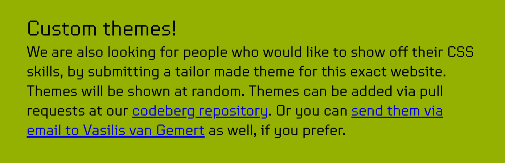
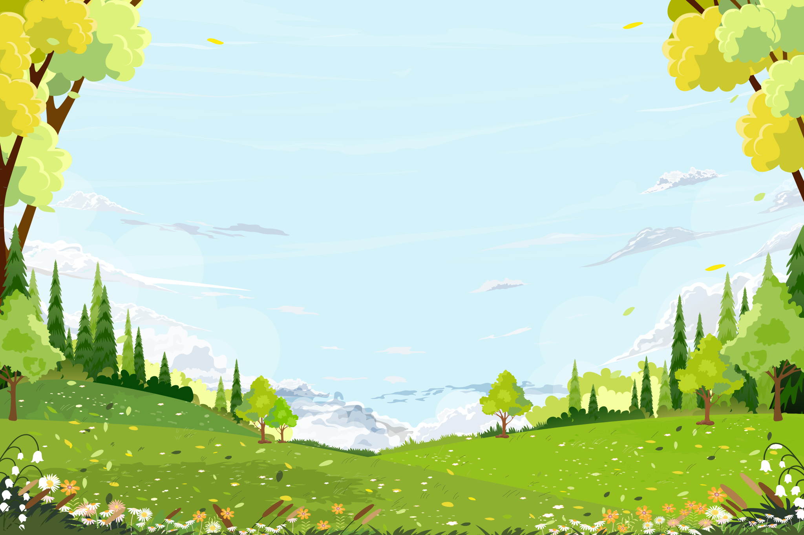
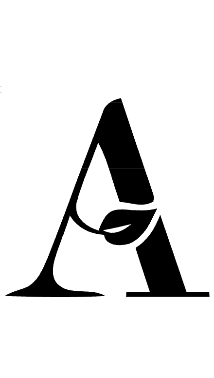
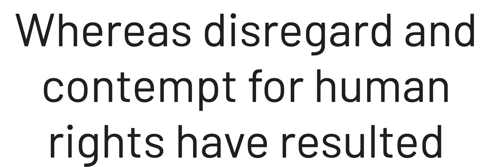
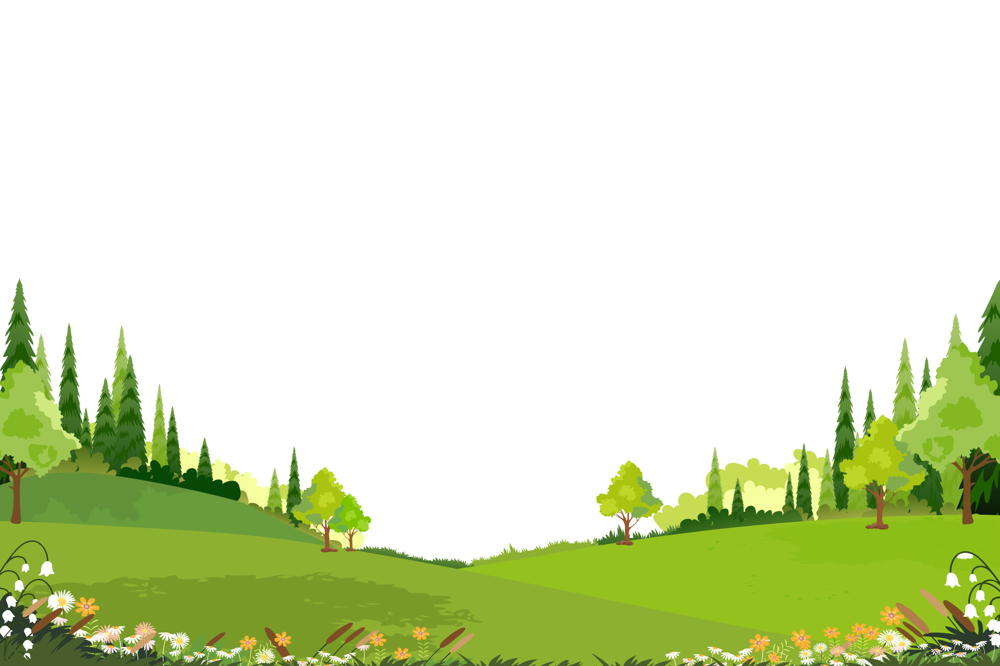
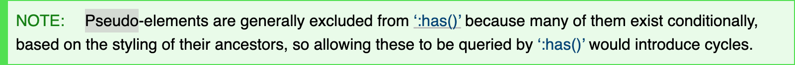

## Turning CSS Carousels into a Theme Switcher

Christian "Schepp" Schaefer

---

<div class="r-hstack">

<div style="align-self: center">

### The setup

<p style="width: fit-content; text-align: left; anchor-name: --iframe-original-text-1"><strong><a href="https://the-web-you-want.org">The Web You Want</a></strong> is a conference happening in Amsterdam right after Smashing Conf.</p>

<p class="fragment zengarden" style="width: fit-content; text-align: left; anchor-name: --iframe-original-text-2">
  <strong>They invited people to submit custom CSS themes</strong> - very much in the spirit of the <a href="https://csszengarden.com">CSS Zen Garden</a> (Dave Shea also spoke at a Smashing Conf not too long ago)
</p>

<br>
<br>
<br>
<br>
<br>
<br>



</div>

<iframe data-src="./stages/original/index.html" data-preload class="iframe-original" style="anchor-name: --iframe-original"></iframe>

</div>

<div class="link iframe-original-text-1-link"></div>
<div class="link iframe-original-text-2-link"></div>

---

### The challenge

Style an existing page however you like. But:

```markdown
## Rules

- Only CSS
- HTML may not be altered (nope, no, no, not possible)
- The content will change, see the comments in the HTML
- Images may only be manipulated with CSS (and images will change)
- Font files with proper licences may be used (a proper licence must be shown)
- Only font-services that are GPDR compliant are allowed (so no adobe or google fonts, to name a few)
- No javascript (only CSS, remember?)
- Think about people’s preferences when it comes to things like animations and colour schemes.
```

<br>

- **don’t touch the HTML**
- **don't add JavaScript**
- the page content may change over time
- user preferences should still be respected (accessibility)

---

### The source material

The supplied page already had a solid semantic structure:

- `<header>`
- `<main>`
- `<section>`
- `<aside>`
- `<footer>`
- a few `<meta>` elements inside `<head>`

That last detail became important later 😏

---

### First idea

Given the name of the conference being   

_"The Web You Want"_   

I wanted the theme to feel:

- optimistic
- nature-inspired 🌱
- maybe solarpunk-ish?
- visually deep, but still playful

So I set out to build the whole thing around a bright spring landscape. <!-- .element: class="fragment" -->

---

<div style="position: relative; height: 200px; margin: 250px 0;">

<h3>Visual ingredients</h3>

<ul>

<li class="fragment">
  <div style="anchor-name: --shutterstock">
    <a href="https://www.shutterstock.com/de/image-vector/sky-blue-cloud-spring-backgroundnature-landscape-2602082071">spring landscape vector from Shutterstock</a>
  </div>
  
  
  
  <div class="link shutterstock-link"></div>
</li>

<li class="fragment">
  <div style="anchor-name: --leafy">
    <a href="https://app.envato.com/search/fonts/65919713-e671-48b5-bfab-60da4c09e536" >Leafy</a> for the main heading
  </div>
  
  
  
  <div class="link leafy-link"></div>
</li>

<li class="fragment">
  <div style="anchor-name: --barlow">
    <a href="https://fonts.google.com/specimen/Barlow">Barlow</a> for the body text
  </div>
  
  
  
  <div class="link barlow-link"></div>
</li>

<li class="fragment">
  <div style="anchor-name: --illustrator">
    Adobe Illustrator to slice the original EPS into layered SVG assets
  </div>

  

  <div class="link illustrator-link-1"></div>

  

  <div class="link illustrator-link-2"></div>

  

  <div class="link illustrator-link-3"></div>
</li>

</ul>

</div>

---

### Why slice the artwork into parts?

Because a single flat illustration would have been too rigid.

Separate SVG layers let me:

- reposition pieces responsively
- stack foreground and background imagery
- create a fake sense of depth


---

<div style="position: relative; height: 200px; margin: 25px 0 375px 0;">

<h3>Putting everything into place</h3>

<ul>

<li class="fragment sky">
   applying a background-color <span style="display: inline-block; width: 1lh; height: 1lh; background: #d3f2f9; border: 1px solid; border-radius: 3px; vertical-align: middle"></span> on <code>html</code> as the sky
</li>

<li class="fragment landscape">
  <div style="anchor-name: --landscape">
    top and bottom landscape ⛰️layers via <code>html::before</code> and <code>html::after</code>
  </div>

  <div style="position: absolute; top: 115%; left: 0; height: auto; max-width: 49%; max-height: none; anchor-name: --landscape-code">
    <pre><code>html::before {
  content: url('landscape-top-part.svg');
  top: 0;
}
html::after {
  content: url('landscape-bottom-part.svg');
  bottom: 0;
}</code></pre>
  </div>

  <div class="link landscape-link"></div>
</li>

<li class="fragment clouds">
  clouds ☁️via <code>body::after</code>
</li>

<li class="fragment light">
  <div style="anchor-name: --light">
    a stylized light ☀️via <code>body::before</code>
  </div>

  <div style="position: absolute; top: 80%; right: 0; height: auto; max-width: 50%; max-height: none; anchor-name: --light-code">
    <pre><code>position: fixed;
top: 5vh;
left: 70vw;
width: 20vmax;
height: 20vmax;
background-color: var(--color-celestial-body);
border-radius: 50%;
box-shadow: 
  0 0 1vmax var(--color-celestial-glow), 
  0 0 50vmax var(--color-celestial-glow), 
  0 0 35vmax var(--color-celestial-glow);</code></pre>
  </div>

  <div class="link light-link"></div>
</li>

<li class="fragment fonts">
   and adding the fonts
</li>

</ul>

</div>

---
<!-- .slide: data-background="#fff" -->

<iframe data-src="./stages/assembled/index.html" data-preload class="iframe-assembled"></iframe>

---

### User preferences

From the beginning, the theme was supposed to respect:

- user font scale settings
- reduced motion settings
- (system) color scheme (light / dark) settings

For the former two I used relative font-sizes and add `prefers-reduced-motion` media queries.

Then it was time to think about the alternative color scheme…

---

### The obvious thought 💡

If the bright version shows a spring day… 🤔

why not turn the very same landscape into a night scene in dark mode? 💡

---
<!-- .slide: class="dark" -->

So I created a second scheme:

- darker sky
- moon instead of sun
- filtered landscape layers
- adjusted contrast and glow

---

### The night version

A lot of the dark mode came from CSS filters and alternate gradients.

```css
@media (prefers-color-scheme: dark) {
  filter: sepia(0.25)
          hue-rotate(147deg)
          brightness(0.25)
          drop-shadow(-1px -1px 2px rgba(255, 255, 255, 0.5));
}
```

That kept the scene recognizable while still making it feel like a different time of day.

---

### Good enough?

Technically yes.

But not really.

Because if the whole point is that this theme contains **two intentionally designed schemes**, then hiding that behind `prefers-color-scheme` feels wasteful.

I wanted people to **discover** the feature.

---

### So I wanted a visible switch

What I wanted:  Auto /  Light /  Dark

<div class="fragment">

What I had:

- no toggle in the DOM
- no checkbox to hijack
- no JavaScript

</div>

That is where the actual experiment started. ✨ <!-- .element: class="fragment" -->

---

### Pseudo-elements would not be enough

The classic ideas fell apart quickly.

- `::before` / `::after` can draw things
- but they are not clickable
- and they do not have states

I needed real interactive affordances.

---

### Then I remembered CSS carousels 💡

<div class="r-hstack" style="gap: 40px">

<video data-autoplay muted src="./videos/css-carousel.mp4" style="flex: 1 1 40%; height: auto; margin-bottom: auto"></video>

<div style="flex: 1 1 60%; text-align: left">

The Chrome team's proposal can generate [carousel controls in CSS](https://developer.chrome.com/blog/carousels-with-css), including:

- scroll buttons (⬅ previous / next ⮕)
- scroll markers (dots ⚪️ ⚪️ ⚪️ )

And those controls are actually interactive!

</div>
</div>

---

### How does it work?

<ol class="r-hstack" style="align-items: stretch">

  <li class="fragment">Create a scroller:

```css
.carousel {
  display: flex;
  overflow-x: auto;
  scroll-snap-type: x mandatory;
  scroll-behavior: smooth;

  > li {
    scroll-snap-align: center;
  }
}


```

  </li>

  <li class="fragment">Add scroll buttons:

```css
.carousel {
  &::scroll-button(left) {
    content: '⬅' / 'Scroll Left';
  }

  &::scroll-button(right) {
    content: '⮕' / 'Scroll Right';
  }
}


```

  </li>

  <li class="fragment">Add scroll markers:

```css
.carousel {
  scroll-marker-group: after;
  
  > li::scroll-marker {
    content: ' ';
  }

  > li::scroll-marker:target-current {
    background: var(--accent);
  }
}
```

  </li>

</ol>

<br>
<br>
<br>

---

### The plan

Can I build a **fake scroller** and then use its generated scroll markers as a theme switcher?

---

### Task: find a scroller 🔍

I needed an **unused element** with **at least 3 children**, that I could turn into a scroller…

<div class="fragment">

That element was: `<head>` !

```html
<head>
	<meta charset="utf-8">
	<meta name="viewport" content="width=device-width, initial-scale=1">
	<title>The web you want</title>
	<link rel="stylesheet" href="css/vasilis.css">
	<meta name="description" content="A two day conference…">
</head>
```

</div>

---

### Yes, `<head>` and `<meta>` can be rendered

It is not rendered by default.

But CSS can change that:

<div class="r-hstack">

```css
head {
  display: flex;
  overflow-x: auto;
  scroll-snap-type: x mandatory;
  scroll-behavior: smooth;
}


```

```css
meta {
  flex-shrink: 0;
  display: block;
  width: 90vw;
  height: 50px;
  border: 2px solid #fff;
  border-radius: 10px;
}
```

</div>

<div class="fragment show-head"></div>

---

### Adding the scroll markers

<div class="r-hstack">

```css
head {
  scroll-marker-group: after;
}

head::scroll-marker-group {
  display: flex;
  gap: 0.5rem;
  justify-content: center;
}

meta::scroll-marker {
  width: 1.5rem;
  height: 1.5rem;
}


```

```css
meta:nth-of-type(1)::scroll-marker {
  content: url('auto.svg') / 'system scheme';
}

meta:nth-of-type(2)::scroll-marker {
  content: url('light.svg') / 'light scheme';
}

meta:nth-of-type(3)::scroll-marker {
  content: url('dark.svg') / 'dark scheme';
}

meta::scroll-marker:target-current {
  background-color: #fff;
  filter: invert(1);
}
```

</div>

<div class="fragment add-scroll-markers"></div>

---

### Hiding the bogus scroller itself

The scroller should exist and work, but not visibly take up space.

```css
head {
  margin-top: -50vh;
}

head::scroll-marker-group {
  position: fixed;
  top: 2rem;
  right: 0;
  left: 0;
}
```

<div class="fragment hide-head"></div>

---

### The real problem

How do I read the selected state back into the stylesheet?

How can the rest of CSS know whether I am on Auto, Light or Dark?

---

### My first instinct: `:has()`

Because `:has()` feels like the natural tool for this.

Something along the lines of:

```css
html:has(meta:nth-of-type(2)::scroll-marker:target-current) {
  --scheme: light;
}

html:has(meta:nth-of-type(3)::scroll-marker:target-current) {
  --scheme: dark;
}
```

---

### That failed ☠️

Because `:has()` cannot inspect pseudo-elements like `::scroll-marker`



[CSS Selectors Level 4 - §4.5. The Relational Pseudo-class: :has()](https://drafts.csswg.org/selectors/#relational)

---

### Time for a detour

If I cannot query the generated marker, maybe I can query **what the marker does**?

What it does is simple: it scrolls the fake scroller.

<div class="fragment">

And scroll position is something CSS \*can\* react to.

Enter **Scroll Driven Animations API**.

</div>

---

### Turning scroll position into an animation timeline

I promoted the `head` to a scroll timeline which can be used to drive CSS animations.

```css
head {
  scroll-timeline-name: --head-timeline;
  scroll-timeline-axis: inline;
}
```

---

### Expose that timeline globally

By default, only descendants can use a scroll timeline to drive CSS animations.

I needed the whole document to see it, so I moved its scope to `html`

```css
html {
  timeline-scope: --head-timeline;
}
```

Now the whole page could react to the hidden scroller’s current position.

---

This timeline can now control an animation:

<div class="r-hstack">

```css
@keyframes celestial {
  from {
    transform: translate(0, 0);
  }
  to {
    transform: translate(0, 90vh);
  }
}
```

```css
/* e.g. our sun/moon */
body::before {
  animation-name: celestial;
  animation-duration: 1ms; /* important */
  animation-timing-function: linear;
  animation-timeline: --head-timeline;
}


```

</div>

<div class="fragment timeline"></div>

---

### Animate a custom property

But I did not animate a visual property, I animated a CSS Custom Property:

<div class="r-hstack">

```css
@keyframes light-preferred {
  from, 50% { --scheme: light }
  to { --scheme: dark }
}

@keyframes dark-preferred {
  50% { --scheme: light }
  from, to { --scheme: dark }
}
```

```css
html {
  animation: light-preferred 1ms step(3);
  animation-timeline: --head-timeline;

  @media (prefers-color-scheme: dark) {
    animation-name: dark-preferred;
  }
}


```

</div>

---

### What I had now

A three-step state machine:

- position 1 → Auto
- position 2 → Light
- position 3 → Dark

All encoded in:

- a hidden scroller
- generated scroll markers
- a scroll-driven animation
- a custom property

No DOM changes. No script.

---

### One final problem

Now I had a custom property called `--scheme` that flips between the values `--light` and `--dark`.

But how do I *consume* it declaratively?

This is where another modern CSS feature entered the stage.

---

### Style queries

```css
html {
  background: var(--color-sky-day);
  color: var(--color-text-day);

  @container style(--scheme: dark) {
    background: var(--color-sky-night);
    color: var(--color-text-night);
  }
}
```

That pattern repeats throughout the stylesheet.

---

### Same trick on the landscape layers

```css
html::before,
html::after {
  filter: drop-shadow(0 0 2px #fff);

  @container style(--scheme: dark) {
    filter: sepia(0.25)
            hue-rotate(147deg)
            brightness(0.25)
            drop-shadow(-1px -1px 2px rgba(255, 255, 255, 0.5));
  }
}
```

That is what makes the scene turn into its night version.

---

### The result

A theme switcher built from:

- CSS-generated marker controls
- a bogus scroller on `<head>`
- scroll-driven animations
- animated custom properties
- style queries

Which is a sentence that sounds made up, but happens to be true.

---

### Thanks!

A fun hack.

A slightly cursed hack.

But a very enjoyable one.

 <!-- .element: style="width: 20vmax; height: 20vmax" -->
